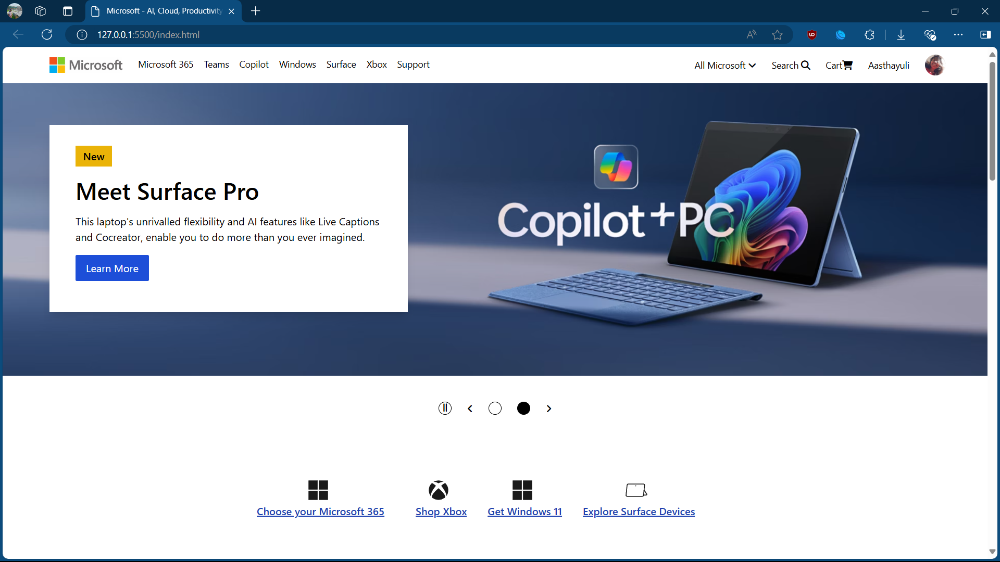
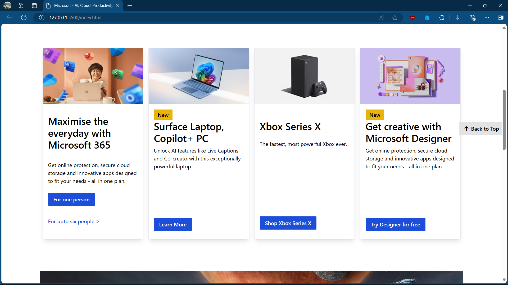
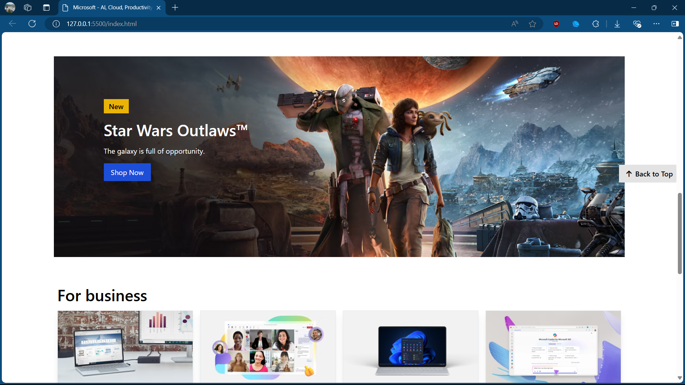

# Microsoft Website Front Page Clone 🖥️

Welcome to my project! This is a clone of the Microsoft website's front page, created using HTML, Tailwind CSS, and a touch of JavaScript. This project showcases my skills with Tailwind CSS and responsive web design. 🚀

## Technologies Used 🔧

- **HTML**: For structuring the content 🏗️
- **Tailwind CSS**: For styling and layout 🎨
- **JavaScript**: For adding some interactive elements ✨

## Features 🌟

- Responsive design that adapts to various screen sizes 📱💻
- Utilizes Tailwind CSS utility classes for modern styling 🔥
- Minimal JavaScript for basic interactivity 🖱️

## Getting Started 🚀

To view this project locally, follow these steps:

1. **Clone the repository**:
   ```bash
   git clone https://github.com/Aasthayuli/Microsoft-Clone.git
   ```
2. **Navigate to the project directory**:

```bash
cd Microsoft Clone
```

3. Open the index.html file in your preferred browser 🌐

## Screenshots 📸





### Future Enhancements 🛠️

- Add more interactive elements with JavaScript 🎯
- Enhance accessibility features ♿
- Include additional pages to replicate the full Microsoft website experience 🌍

## Contributing 🤝

Contributions are welcome! Please fork the repository and create a pull request with your changes.

## License 📜

This project is licensed under the MIT License. See the [LICENSE]() file for more details.

## Acknowledgements 🙏

- Microsoft for the inspiration behind this clone project.
- Tailwind CSS documentation for providing excellent resources and guidance.
